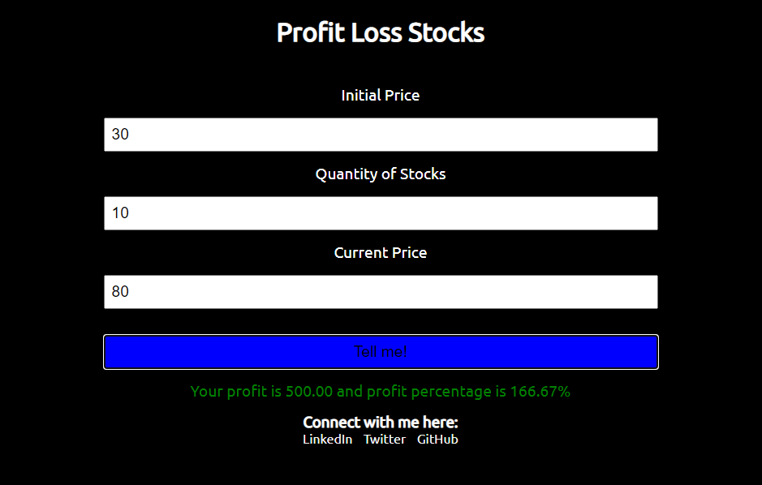

<h1>Profit Loss Stocks Application</h1>
A simple application which tells you if you are in profit or loss on the basis of Initial Price, Quantity of Stocks and Current Price.

<h1>How does it work?</h1>
User has to enter all three values in Initial Price, Quantity of Stocks and Current Price. After clicking on Tell Me the application does the math for you and tells you if you are in loss or profit.

<h1>Tech Stack Used:</h1>
<ul>
    <li>HTML</li>
    <li>CSS</li>
    <li>JavaScript</li>
</ul>

